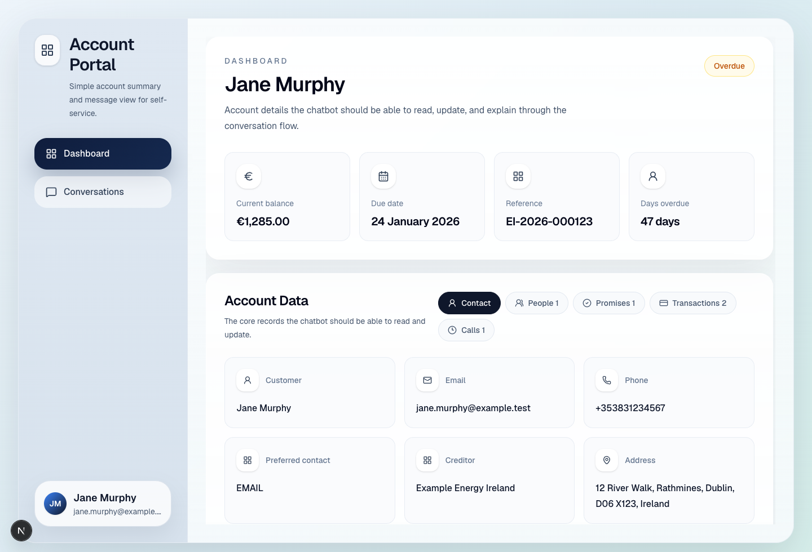

# Account Self-Service Chatbot Challenge

Build this starter into a small but credible account self-service chatbot for a customer who owes money on an overdue account.

The goal is to test whether you can turn everyday customer messages into safe product actions that are saved in a database. The app should feel simple, but the server-side behaviour should be clear enough that a reviewer can inspect what happened and why.

## Plain English terms

You do not need debt-collection or finance experience to complete this challenge. These terms appear throughout the brief:

- **Receivables account**: money a customer owes to a business. Example: Jane missed an energy bill payment, so her energy provider has an overdue receivables account for her.
- **Account holder**: the customer whose account this is. In the starter data, this is Jane Murphy.
- **Creditor**: the business that is owed money. In the starter data, this is Example Energy Ireland.
- **Overdue account**: an account where payment was due in the past and has not been fully paid.
- **Balance**: the amount still owed.
- **Transaction**: a record of money moving on the account, such as a charge, fee, adjustment, or payment.
- **Promise to pay**: a customer's agreement to pay a specific amount on a future date. Example: "I can pay 500 euro on the 1st of next month."
- **Related person**: someone the customer adds to the account, such as a spouse or sibling, who may be allowed to speak or act for them.
- **Preferred contact method**: how the customer wants to be contacted, such as email, SMS, or phone.
- **Persistence / persisted data**: data that is saved in the database and still exists after the page is refreshed.
- **Fixture data**: starter sample data in JSON files. It is fake data used so the app has something to show before you connect the database.
- **Supabase**: the database service used in this challenge. Use it to store account data so changes survive refreshes.
- **Resend**: the email service used in this challenge. Use it to send the account-change notification email.
- **Mocked payment**: a fake payment for this challenge. You should record it and reduce the balance, but you should not contact a real payment provider.
- **Encrypted PDF**: a password-protected PDF attachment. In this challenge, sensitive account details should go in this PDF instead of the email body.
- **API route**: server-side code that the frontend calls. In this starter, `/api/chat` is the backend route the chat UI calls.
- **Notification boundary**: the place in the code where the app sends or logs the email notification. Tests should fake this part instead of sending real email but the deployed production app should send real emails.
- **Acceptance scenario / contract test**: an example workflow the finished app should handle. The skipped tests show important behaviours you can turn into real tests.

## Start here

Create your own private copy of this repository first, then run it locally:

1. On GitHub, click the green `Use this template` button.
2. Create a new repository from this template.
3. Set the new repository visibility to `Private`.
4. Clone your new repository to your machine.
5. `cd` into the repository.
6. Run `pnpm i`.
7. Run `pnpm dev`.
8. Open `http://localhost:3000` in your browser, or use the next available port shown by Next.js.

Useful checks:

- `pnpm lint`
- `pnpm typecheck`
- `pnpm test`

## Environment variables

Copy `.env.local.example` to `.env.local` when you are ready to connect real services:

```bash
cp .env.local.example .env.local
```

The starter app runs without these values, but a complete submission will usually need:

```bash
NEXT_PUBLIC_SUPABASE_URL=https://your-project-ref.supabase.co
NEXT_PUBLIC_SUPABASE_PUBLISHABLE_KEY=your-publishable-key

RESEND_API_KEY=re_your_api_key
NOTIFICATION_FROM_EMAIL=Account Portal <notifications@example.test>

# Choose one provider for message parsing. Do not commit real keys.
OPENAI_API_KEY=sk-your-openai-key
ANTHROPIC_API_KEY=sk-ant-your-anthropic-key
OPENROUTER_API_KEY=sk-or-your-openrouter-key
```

## Expected use of AI tools

We expect you to code with a coding assistant such as Codex, Claude Code, Cursor, or similar. Using AI tools well is part of modern software engineering.

You are still responsible for the submission. You must understand the code that is produced and be able to explain the architecture, data model, tradeoffs, tests, and any AI-generated changes you accepted or rejected.

## Recommended design workflow tip

Before building, we recommend using Matt Pocock's `grill-with-docs` / `grill-me` style workflow to work through the problem with an LLM. We use this approach regularly because it helps the model ask questions, inspect the codebase, sharpen assumptions, and produce a better solution than trying to generate everything in one shot.

- Video explanation: [Matt Pocock skill walkthrough](https://www.youtube.com/watch?v=6BB6exR8Zd8&t=651s)
- Installation guide: [AI Hero: Skills - Grill Me](https://www.aihero.dev/skills-grill-me)

## UI preview

This is what the starter UI looks like before you begin extending it:



## Recommended: deploy to Vercel immediately

Wire up deployment before you start building so you always have a live URL to test and share.

1. Create a Vercel account at [vercel.com](https://vercel.com/) if you do not already have one.
2. In Vercel, click `Add New...` and choose `Project`.
3. Import the GitHub repository you created from this template.
4. Review the default settings and click `Deploy`.
5. Once deployment finishes, use the live URL to verify the app is up.
6. After that, every push to GitHub will automatically trigger an updated Vercel deployment.

## The task

Use the existing implementation in this repository as your starting point. Extend it into an account self-service chatbot where an account holder can ask questions and perform account actions through chat.

A user might send messages such as:

- "Can you add my brother Mark as someone who can speak for me?"
- "What's the email address on my account?"
- "Change my preferred contact method to SMS."
- "Can I pay 500 euro on the 1st of next month?"
- "Show me all my promises to pay."
- "Pay 150 euro now."
- "Can I book a call with an agent next Tuesday morning?"
- "Show my previous transactions."
- "Change Mark's phone number to +353831112233."

Your chatbot should parse the request, ask for missing details where needed, apply valid changes to persistent data, and return a clear confirmation.

## Recommended build path

Most good submissions will follow this path:

- seed Supabase from the fixture data. You can start Supabase locally on your machine with Docker if you'd like (recommended), or you can develop against a remote Supabase DB if you'd prefer.
- replace the starter fixture read with a real account loaded from the database
- implement `/api/chat` so messages become structured actions and fields
- validate each action before writing account data
- persist account, related-person, promise, payment, transaction, and call changes
- send the notification email with encrypted PDF after data changes
- refresh the UI from persisted account state
- turn the skipped acceptance tests into real tests, or add equivalent coverage
- deploy the app and document the live URL

## Scope and mocking rules

- Mock payments only. Do not integrate Stripe or any real payment provider.
- You may log notification payloads locally when Resend credentials are missing.
- The deployed app should send through Resend and attach the encrypted PDF.
- Automated tests should mock LLM providers, Resend, PDF delivery, and payment side effects.
- Do not commit API keys, Resend keys, Supabase service-role keys, or generated PDF passwords.
- Do not add an authentication system, a multi-account admin dashboard, recurring payment plans, or a production-grade collections workflow.

## Minimum expected behaviour

### Account lookup

- Read the current account holder's name, email address, phone number, postal address, preferred contact method, balance, related people, transactions, promises to pay, and future call appointments.
- Use the fixture data in `fixtures/` as the starting account context.
- Seed or migrate the data into Supabase so changes survive refreshes.

### Update account holder details

- Let the account holder update their name, email address, phone number, and postal address through chat.
- Let the account holder read those details back through chat.
- Validate obvious bad inputs, such as an invalid email address or an empty name.

### Preferred contact method

- Let the account holder read and update their preferred contact method.
- Supported methods are `email`, `sms`, and `phone`.
- Confirm the new preference in chat and persist it.

### Related people and authorization

- Let the account holder add a related person who can represent them.
- Capture the related person's name, phone number, and email address.
- Store whether the related person is authorized to act on the account holder's behalf.
- Let the account holder read, update, and remove related people.
- The chatbot should be able to edit both account-holder details and related-person details.

### Promise to pay

- Support one-time promises to pay in the future.
- Capture at least amount and due date.
- Example: "Can I pay 500 euro on the 1st of next month?"
- Store the promise to pay in the database.
- Let the account holder read all promises to pay.
- Do not build multi-payment plans for this challenge.

### Mock payment

- Let the account holder make a mocked payment through chat.
- Pretend payment details are already on file.
- Confirm that the amount was deducted from their account.
- Record the payment as a transaction.
- Deduct the paid amount from the persisted account balance.
- Do not call Stripe or any other real payment provider.

### Transactions

- Let the account holder read all previous transactions.
- Include seeded transactions from the fixture and new mocked payments created during the chat.
- Show useful fields such as date, amount, type, status, and description.

### Call appointments

- Let the account holder book a future phone call with an agent.
- Capture date, time, phone number, and short reason where possible.
- Let the account holder view future call appointments.
- Reject appointment requests that are clearly in the past.

### Email notification and encrypted PDF

Use [Resend](https://resend.com/) for email sending. It has a free tier.

Whenever the chatbot changes persisted account data, send a generic notification email to the account holder's current email address. The email body should not contain sensitive account detail. Put the sensitive detail in an encrypted PDF attachment.

The PDF should include:

- Account summary
- Related people, if any
- Transactions
- Current contact details
- Preferred contact method
- Promises to pay
- Future call appointments
- Current balance

Use the last 4 digits of the account holder's phone number as the PDF password. The starting phone number for every fixture account is `+353831234567`, so the initial PDF password is `4567`.

For local development, it is acceptable to log the email payload when Resend credentials are missing, but the production/deployed app should be wired to Resend.

For tests, mock the notification boundary. Do not make automated tests depend on live Resend delivery or real inbox inspection. Reviewers should be able to verify from code and logs that production sends through Resend and attaches the encrypted PDF.

## LLM guidance

You should use an LLM to parse free-text messages into structured actions and fields. This is one of the most useful parts of the exercise: the system needs to infer intent and extract details from messy incoming text before applying controlled business logic.

You can use your own API key from a provider such as OpenAI, Anthropic, OpenRouter, or another model service. Do not commit API keys or secrets to the repository.

Good enough is structured extraction plus deterministic validation. Prefer a small parser that turns a customer message into an intent and fields, followed by explicit validation and business logic. You do not need to build a fully autonomous agent framework.

A rule-based action router, structured form fallback, or hybrid approach is also fine. What matters is that the system:

- handles the required workflows
- asks for missing information instead of guessing dangerous details
- keeps state transitions understandable and testable
- has sensible fallback behaviour for ambiguous messages
- avoids exposing sensitive data in email bodies or logs

## Technical notes

- Build on this repository rather than starting from scratch.
- Use Supabase so changed account data survives refreshes.
- Start from `supabase/migrations/`, which includes a minimal table outline and seeded Jane Murphy account data.
- You may change the schema, but document the final shape and tradeoffs in your design note.
- Treat account data as sensitive. Do not log full account summaries, PDF passwords, or sensitive PDF contents.
- Keep the core logic understandable and testable. Small services for parsing, validation, database writes, mocked payment, appointments, and notifications are usually enough.

Useful Supabase references:

- [Supabase Next.js quickstart](https://supabase.com/docs/guides/getting-started/quickstarts/nextjs)
- [Supabase local development](https://supabase.com/docs/guides/local-development)
- [Supabase database migrations](https://supabase.com/docs/guides/deployment/database-migrations)

## Example acceptance scenarios

Your submission should handle these flows end to end. See `docs/scenarios.md` for more detail.

The repository includes skipped examples in `src/lib/chat/chat-contracts.test.ts`. Turn those into real tests or add equivalent coverage for your own action router.

1. User asks, "What phone number is on my account?" Chatbot returns the current phone number.
2. User asks, "Change my phone number to +353831112233." Chatbot updates the database, confirms the change, and sends the notification email with encrypted PDF.
3. User asks, "Add Mark Murphy, mark@example.test, +353831998877 so he can act for me." Chatbot creates an authorized related person and sends the notification email with encrypted PDF.
4. User asks, "Can I pay 500 euro on the 1st of next month?" Chatbot records a one-time promise to pay with amount and date.
5. User asks, "Show my promises to pay." Chatbot lists stored promises.
6. User asks, "Pay 150 euro now." Chatbot records a mocked payment transaction and reduces the account balance.
7. User asks, "Show my transactions." Chatbot lists seeded and newly created transactions.
8. User asks, "Book a call next Tuesday at 10am about my bill." Chatbot schedules a future call appointment.
9. User asks, "What calls do I have booked?" Chatbot lists future call appointments.

## Deliverables

Submit:

- source code in this repository
- setup instructions
- a deployed version of the application, with the live URL linked from `README.md`
- an updated `README.md` with a short design note of no more than 800 words covering architecture, tradeoffs, assumptions, and how you would improve, monitor, and evolve the system over time
- an architecture diagram saved in the repo root as `architecture-diagram.png`, `architecture-diagram.pdf`, or `architecture-diagram.md`
- tests for the core decision/action logic

When you are finished, invite `wardch` as a collaborator so the submission can be reviewed. Your `README.md` should link to the deployed application and architecture diagram, explain how the system works, and answer: how can you improve and monitor this system over time?

## What we're evaluating

- product and engineering judgment
- safe handling of account data
- quality of chat intent/action handling
- quality of database design and persistence
- quality of validation and error handling
- mocked payment correctness, including balance deduction and transaction history
- email/PDF notification implementation
- handling of ambiguous input and missing details
- code quality and structure
- test quality
- clarity of explanation
- quality of the suggested iteration path over time

Hard failure cases:

- no persistence for changed account data
- no tests for core decision/action logic
- real payment provider integration instead of mocked payment
- sensitive account detail in the email body
- account data changes with no notification attempt
- deployed submission cannot send through Resend with an encrypted PDF attachment
- broad rewrites that discard the starter UI instead of building on it

## Project structure

- `src/app/page.tsx` wires the standard fixture into the main portal UI.
- `src/components/debtor-portal.tsx` contains the current dashboard and chat UI.
- `src/app/api/chat/route.ts` marks the backend chat route candidates should implement.
- `src/lib/account/types.ts` and `src/lib/chat/types.ts` define the starter contracts.
- `src/lib/notifications/account-change-notification.ts` marks the notification side-effect candidates should implement.
- `supabase/migrations/` contains the starter database schema and seed data.
- `docs/account-context.md` explains fixture fields and mutability.
- `docs/scenarios.md` gives acceptance-flow examples.
- `src/lib/supabase/client.ts` provides a browser client factory for later integration.
- `fixtures/` contains the provided account data.
