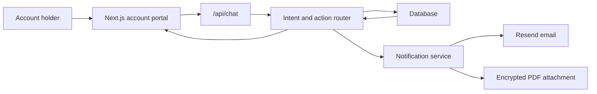

# Architecture Diagram

Replace or extend this diagram in your submission.

```mermaid
flowchart LR
  User["Account holder"] --> UI["Next.js account portal"]
  UI --> ChatAPI["/api/chat"]
  ChatAPI --> Router["Intent and action router"]
  Router --> DB["Database"]
  Router --> Notification["Notification service"]
  Notification --> Email["Resend email"]
  Notification --> PDF["Encrypted PDF attachment"]
  DB --> Router
  Router --> UI
```
