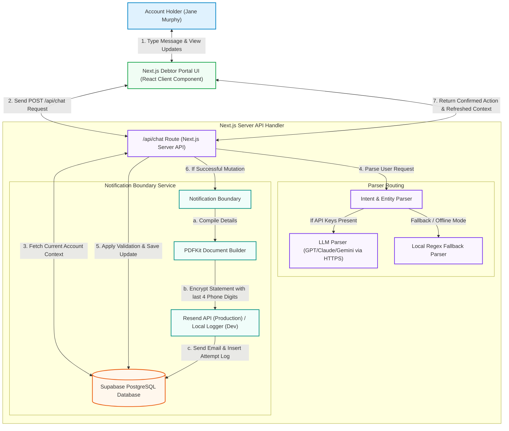

# PayPathIQ System Architecture Diagram

This document details the system design, request lifecycle, data flow, and components of the PayPathIQ self-service debtor portal.

---

## 1. Architecture Flowchart

---

## 2. Component Directory & Responsibilities

| Component | Responsibility | Technology Stack |
|---|---|---|
| **Chat UI Layer** | Preserves dynamic client state, displays message history, and synchronizes the debtor dashboard dynamically on chatbot confirmations. | Next.js, React Client Components, Tailwind CSS |
| **API Endpoint** | Orchestrates account lookups, extraction parsing, business logic validation, state changes, and notification dispatches. | Next.js App Router API Route (`/api/chat`) |
| **Hybrid Parser** | Extracts intent and fields (e.g. amount, due date, phone numbers). Supports OpenAI, Anthropic, Gemini, or OpenRouter, falling back to a deterministic local parser. | Next.js Server Utility |
| **Database Persistence** | Stores the core debtor entities: account holders, related representatives, promise details, transaction logs, callback bookings, and notification metrics. | Supabase (PostgreSQL) |
| **PDF Statement Generator** | Generates a base64 PDF summary, setting PDFKit encryption permission keys and a user password using the last 4 digits of the phone number. | PDFKit Utility |
| **Notification Gateway** | Dispatches standard updates containing the password-protected attachment in production, falling back to secure terminal log output in dev mode. | Resend REST API |

---

## 3. End-to-End Request Lifecycle Example
1. **User Input**: Jane Murphy types *"Change Mark Murphy's phone number to +353831112233"* and hits send.
2. **Context Setup**: The API route receives the message, querying Supabase for the current snapshot of Jane's account (`acc_standard_001`).
3. **Intent Parsing**: The parser extracts the action `update_related_person` and parameters `{ name: "Mark Murphy", phone: "+353831112233" }`.
4. **Validation Check**: The route verifies that Mark Murphy is a registered representative.
5. **Database Transaction**: Supabase executes the update.
6. **Notification Trigger**: 
   * PDFKit builds a statement including current balances, contact info, and related people.
   * The statement is encrypted using password `4567` (the last 4 digits of Jane's phone number `+353831234567`).
   * Resend sends the email, and a row is logged in `notification_attempts`.
7. **UI Synchronization**: The API returns the success flag and the refreshed data snapshot, immediately updating the "People" list on Jane's screen.
